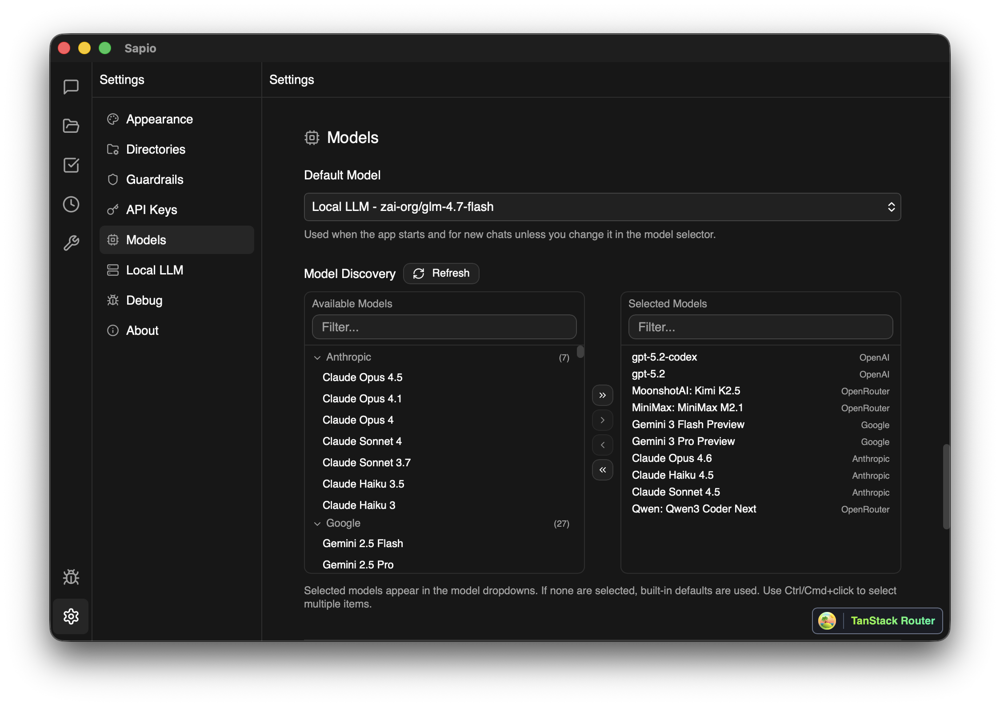

# Sapio

A local-first personal AI assistant that runs as a native desktop app (via Tauri) or in the browser. Sapio keeps your data on-device, learns over time, and acts autonomously on your behalf — with configurable safety guardrails so you stay in control.

Built by [Fertilis.ai](https://fertilis.ai).



## Features

### AI Chat
- Conversational interface with streaming responses and Markdown rendering
- Multi-provider LLM support: **Anthropic**, **OpenAI**, **Google**, **OpenRouter**
- Automatic model discovery — fetches available models from each provider
- Agent selector to switch between specialized agents mid-conversation
- Conversation history with sidebar navigation and folder organization

### Agentic Loop
- Multi-step agent execution with real-time progress tracking
- Tool calls displayed as visual cards with execution results
- Context sharing across agent runs
- Powered by the [pi-mono](https://github.com/nicholasgasior/pi-mono) agent runtime

### File Management
- Built-in file editor with syntax highlighting (Shiki)
- File tree browser with create, rename, and delete operations
- Tabbed editing interface
- Search within files

### Task Management
- Kanban board with drag-and-drop task cards
- Task creation/editing modal with rich fields
- Sidebar navigation for task organization

### Scheduler
- CRON-based task scheduling with a visual cron builder
- Human-readable schedule descriptions (via cronstrue)
- Execution tracking and history

### Toolbox
- Central hub for managing agent extensions:
  - **Prompts** (`.yaml`) — reusable prompt templates
  - **Memories** (`.md`) — persistent agent context
  - **Agents** (`.md`) — specialized agent configurations
  - **Skills** (`.md`) — agent capability definitions
  - **Workflows** (`.yaml`) — multi-step automation sequences
  - **MCP** (`.json`) — Model Context Protocol server configs
- Execution history viewer
- YAML/Markdown editor with syntax highlighting

### Guardrails
- Three safety presets for tool execution: **Normal**, **Advanced**, **YOLO**
- Confirmation bar for high-risk actions
- Undo/redo manager for reversible operations

### Settings
- Appearance customization with dark/light mode and hue presets
- Per-provider API key management with secure OS keychain storage
- Model picker with multi-select across providers
- Configurable directory paths
- Local LLM support

### Desktop App (Tauri)
- Native macOS, Windows, and Linux builds
- 33 Rust commands for OS integration: file I/O, shell execution, clipboard, notifications, HTTP, keychain, logging
- Bundled pi-sidecar binary for background agent processing
- Custom DMG installer with branded background (macOS)

## Tech Stack

| Layer | Technology |
|---|---|
| UI Framework | React 19 + TypeScript (strict) |
| Routing | TanStack Router v1 (file-based, type-safe) |
| Forms | TanStack React Form |
| State Management | Zustand (11 stores) |
| Styling | TailwindCSS v4 + shadcn/ui |
| Icons | Lucide React |
| Syntax Highlighting | Shiki |
| Dark Mode | next-themes |
| Toasts | Sonner |
| Validation | Zod |
| AI Runtime | pi-mono (@mariozechner/pi-ai, pi-agent-core) |
| Desktop Runtime | Tauri v2 (Rust backend) |
| Secure Storage | OS keychain (keyring crate) |
| Build Tool | Vite 6 |
| Package Manager | Bun 1.3 |
| Monorepo | Turborepo 2.6 |
| Testing | Vitest + Testing Library |

## Getting Started

### Prerequisites

- [Bun](https://bun.sh/) v1.3+
- [Rust](https://rustup.rs/) (only required for building the desktop app)

### Install

```bash
git clone https://github.com/fertilis/sapio-app.git
cd sapio-app
bun install
```

### Run (web)

```bash
bun run dev:web
```

Opens at [http://localhost:3001](http://localhost:3001).

### Run (desktop)

```bash
cd apps/web
bun run desktop:dev
```

This starts the Vite dev server and launches the Tauri window connected to it.

## Project Structure

```
sapio-app/
├── apps/
│   └── web/                        # React frontend + Tauri desktop runtime
│       ├── src/
│       │   ├── components/
│       │   │   ├── chat/           # Chat UI, sidebar, input, message rendering
│       │   │   ├── files/          # File editor, tree browser, tabs
│       │   │   ├── tasks/          # Kanban board, task cards, modal
│       │   │   ├── scheduler/      # Cron builder, schedule list
│       │   │   ├── toolbox/        # Tool editor, execution history
│       │   │   ├── settings/       # Model picker, guardrails config
│       │   │   ├── shared/         # Reusable sidebar tree, context menus
│       │   │   ├── layout/         # App header, sidebar, loader
│       │   │   ├── debug/          # Debug sidebar and viewer
│       │   │   └── ui/             # shadcn/ui primitives
│       │   ├── routes/             # TanStack Router file-based routes
│       │   ├── stores/             # Zustand state management (11 stores)
│       │   ├── lib/
│       │   │   ├── agentic/        # Agent adapter, context sharing
│       │   │   ├── guardrails/     # Safety evaluator, presets, undo manager
│       │   │   ├── tools/          # System tools, web tools, categories
│       │   │   └── hooks/          # Custom React hooks
│       │   └── test/               # Test setup and mocks
│       └── src-tauri/
│           ├── src/
│           │   ├── commands.rs     # 33 Tauri commands (Rust)
│           │   ├── lib.rs          # Plugin initialization
│           │   └── main.rs         # Entry point
│           ├── bin/                # Bundled pi-sidecar binary
│           ├── icons/              # App icons (macOS, Windows, Linux, mobile)
│           └── tauri.conf.json     # Desktop app configuration
├── packages/
│   ├── config/                     # Shared TypeScript configuration
│   ├── env/                        # Type-safe environment variables (T3 env-core)
│   └── pi-sidecar/                 # AI sidecar process builder
├── assets/                         # Logos and screenshots
├── turbo.json                      # Turborepo task orchestration
└── package.json                    # Workspace root
```

## Architecture

### File-Based Routing

Routes auto-generate from `apps/web/src/routes/`. The TanStack Router plugin produces `routeTree.gen.ts` — do not edit it manually.

| Route | View |
|---|---|
| `/` | Home / landing |
| `/chat` | AI chat interface |
| `/files` | File browser and editor |
| `/tasks` | Kanban task board |
| `/scheduler` | CRON scheduler |
| `/toolbox` | Prompts, agents, skills, workflows, MCP |
| `/settings` | Appearance, API keys, models, guardrails |
| `/debug` | Debug utilities |

### State Management

Eleven Zustand stores manage application state, each with a corresponding test file:

- **chat-store** — conversations, message streaming, model resolution
- **agentic-loop-store** — multi-step agent execution, tool call tracking
- **agent-store** — agent definitions and selection
- **file-store** — file tree, open tabs, editing state
- **task-store** — kanban board, task CRUD
- **scheduler-store** — CRON schedules, execution tracking
- **toolbox-store** — prompts, memories, agents, skills, workflows, MCP
- **settings-store** — API keys, model selection, guardrails, appearance
- **tool-history-store** — tool execution history
- **layout-store** — sidebar and panel state
- **debug-store** — debug logging

### Tauri Commands (Rust Backend)

The desktop app exposes 33 commands to the frontend:

- **File operations** — read, write, delete, rename, backup/restore, directory listing
- **Config** — read/save app configuration
- **Shell** — execute shell commands
- **Clipboard** — read/write system clipboard
- **Notifications** — send OS notifications
- **HTTP** — make HTTP requests
- **Keychain** — store, retrieve, delete API keys securely
- **Logging** — append, read, clear log files
- **Sidecar** — start/manage the pi-sidecar process

### Storage

All user data persists locally in `~/.sapio/`:
- Conversations, files, tasks, schedules, and toolbox items are stored as files
- Folder metadata supports hierarchical organization
- Falls back to `localStorage` when running in the browser (without Tauri)

### Build Pipeline

Turborepo orchestrates builds with dependency awareness:

```
turbo build
  ├── @sapio-app/config    (shared TS config, no output)
  └── @sapio-app/env       (env validation, no output)
    └── web
       ├── Vite → dist/          (frontend bundle)
       └── Tauri → native app    (desktop builds only)
```

Vite uses a custom `nodeStubsPlugin` to provide no-op polyfills for Node.js builtins (fs, stream, etc.) so the bundle works in both browser and Tauri webview contexts.

## Available Scripts

### From the repository root

| Command | Description |
|---|---|
| `bun run dev` | Start all apps in development mode |
| `bun run dev:web` | Start the web app only (port 3001) |
| `bun run build` | Build all apps for production |
| `bun run build:sidecar` | Build the pi-sidecar binary |
| `bun run check-types` | TypeScript type checking across all workspaces |

### From `apps/web/`

| Command | Description |
|---|---|
| `bun run dev` | Start Vite dev server |
| `bun run build` | Production build |
| `bun run serve` | Preview production build |
| `bun run check-types` | TypeScript type checking |
| `bun run test` | Run Vitest in watch mode |
| `bun run test:run` | Run Vitest once |
| `bun run desktop:dev` | Start Tauri desktop app (dev) |
| `bun run desktop:build` | Build Tauri desktop app for distribution |

## Desktop Builds

### Development

```bash
cd apps/web
bun run desktop:dev
```

### Production

```bash
cd apps/web
bun run desktop:build
```

This produces platform-specific installers:
- **macOS** — `.dmg` with custom background and app icon
- **Windows** — `.exe` (NSIS installer)
- **Linux** — `.AppImage`, `.deb`

To build only a macOS DMG:

```bash
cd apps/web
bunx tauri build --bundles dmg
```

### Regenerating App Icons

```bash
bunx tauri icon assets/fertilis_logo_white.png
```

## Testing

Tests use **Vitest** with **Testing Library** and a jsdom environment.

```bash
# Watch mode
cd apps/web && bun run test

# Single run
cd apps/web && bun run test:run
```

Coverage thresholds (configured in `vitest.config.ts`):

| Metric | Threshold |
|---|---|
| Lines | 80% |
| Functions | 75% |
| Branches | 70% |

## Roadmap

Sapio's foundation is complete. The following areas are planned for future development:

- **Persistent Memory** — local file-based memory system so the agent retains context across sessions
- **Progressive Autonomy** — trust framework where the agent starts supervised and gradually earns independence
- **Multi-Agent Coordination** — specialized agents collaborating on complex tasks
- **Cloud Sync** — optional end-to-end encrypted sync across devices
- **Voice & Multimodal Input** — speech-to-text and image understanding
- **Advanced Search** — semantic search across conversations, files, and memories
- **CI/CD Pipeline** — automated builds, testing, and release packaging

## License

[MIT](LICENSE) — Copyright (c) 2026 Fertilis
